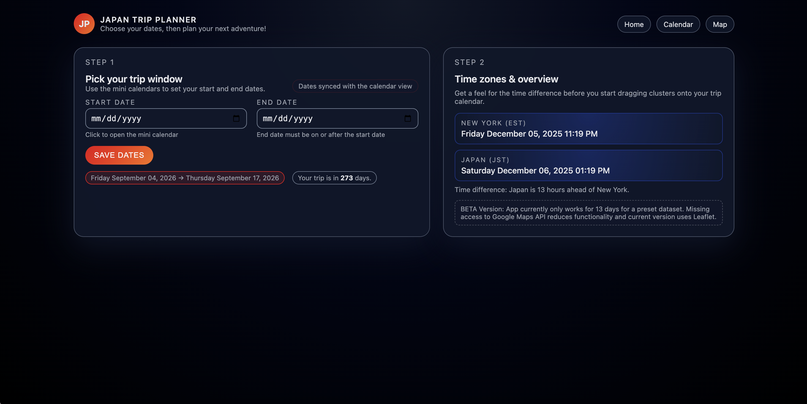
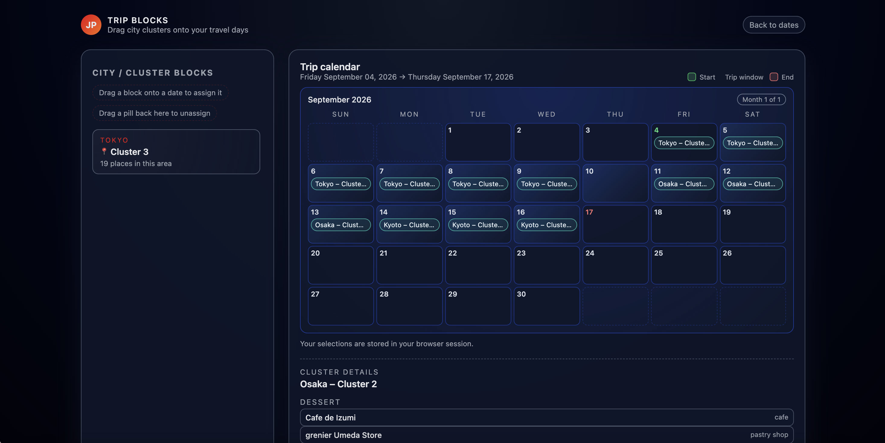
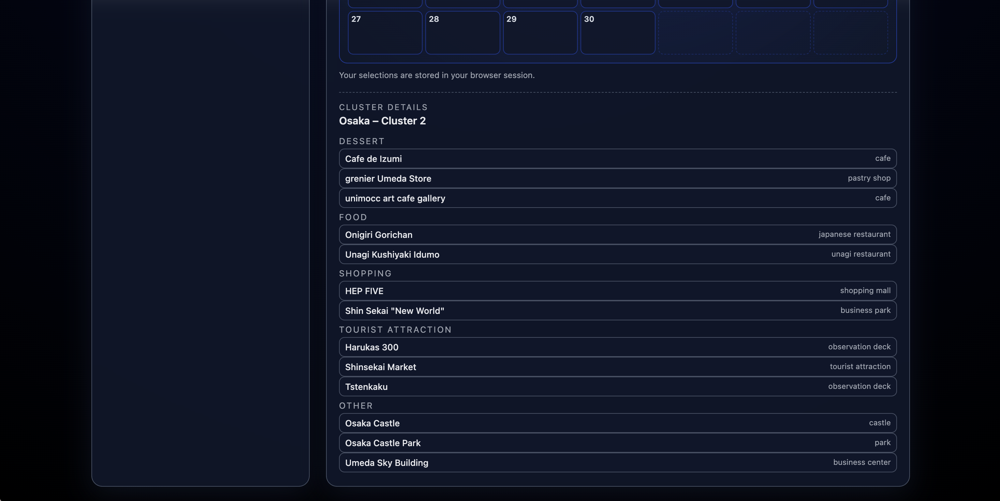
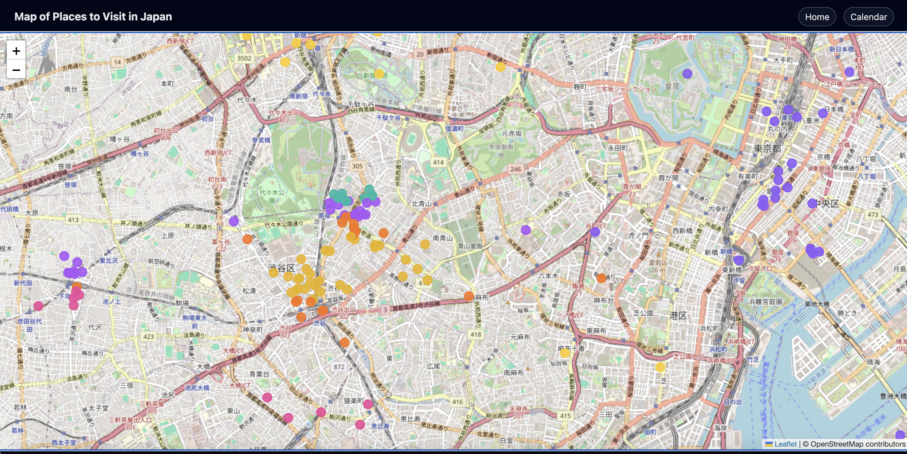

# Trip-Planner Web Application

## I. Project overview

This project is a small Flask web application I originally built while planning my own trip to Japan. I had a long list of saved places across Tokyo, Kyoto, and Osaka (restaurants, cafes, temples, shops), and I wanted a way to organize everything I wanted to do into a realistic day-by-day itinerary by grouping places that were close together and easy to visit in a single day.

The app takes a static JSON export of places in Japan, cleans and enriches the data, then clusters locations within each city into “day-sized” groups. These groups are displayed in the UI as draggable pills that the user can drop onto a calendar to assign them to specific days of the trip. An interactive map view shows all the places with color-coded markers by cluster, so it’s easy to see what a “day” looks like geographically.

From a technical perspective, the project combines:
- A data preparation and clustering pipeline in Python (`pandas`, `numpy`, `scikit-learn`)
- A Flask backend that serves pages, manages session-based itineraries, and exposes endpoints for saving calendar assignments
- A simple frontend with HTML/CSS, vanilla JavaScript, and Leaflet.js for the map, as well as drag-and-drop interactions on the calendar

Because this started as a personal trip-planning tool, the app is built with my own trip in mind and not fully generalized: it expects specific JSON datasets, assumes a fixed set of cities and a rough number of days in each, and stores state in a single user session rather than a shared database. Note that in its beta state, it works best if the input dates are September 4, 2026 and September 17, 2026. The rest of the README focuses on how the clustering works, what the current limitations are, and how I would evolve this into a more reusable, production-ready tool with more time.

## II. Demo 

### Screenshots

**Home page - set up your trip**

This is the landing page where the user selects the trip dates. The app uses this information to generate the calendar view and determine how many cluster “slots” to show.

---

**Calendar view - build a day-by-day itinerary**

The calendar view shows:

- A list of clusters on the left (e.g. “Tokyo – Cluster 3”)  
- A multi-day calendar in the center  
- A details panel that shows all places in the selected cluster  

Users can drag the cluster pills from the left onto specific days in the calendar to assign them to that date. Each cluster can only appear on one day at a time, so dragging it to a different day automatically moves it.

---

**Cluster details - see what’s in a “day”**

When a cluster is selected, the panel below the calendar shows all the places in that group, including the name and type of place, organized by category. This helps the user understand what a “day” in that area looks like.

---

**Map view - color-coded clusters**

The map view displays all places on an interactive Leaflet map, with markers color-coded by `city_cluster` (e.g. Tokyo3, Kyoto1). Clicking a marker shows the name of the place and which group it belongs to, so the user can see how each day’s cluster is laid out geographically.

---

### Typical workflow

A typical way to use the app is:

1. **Set up the trip** on the home page by entering the dates.
2. **Browse clusters** on the calendar page, clicking on a cluster if it's on the calendar to see the list of places in that area.
3. **Drag clusters onto specific days** in the calendar to sketch out a day-by-day plan.
4. **Check the map view** to make sure a given day’s cluster is geographically reasonable and adjust if needed.
5. **Repeat** until the itinerary looks good for the whole trip.

## III. How to run
1. Download the `Japan webapp` folder and make sure it has the following:
   1. `data` (folder with 2 JSON files)
   2. `templates` (folder with 4 HTML files)
   3. `app.py` (Flask app)
   4. `JPN_data.py` (data cleaning + clustering script)
2. Ensure the `data` folder contains `japan_saved_080424.json` and `additional_080424.json`. The script will load them automatically.
3. Start the app from `app.py`
    1. Install the required Python packages if needed (refer to `requirements`)
4. Open `http://localhost:5000` in your browser
5. Plan your trip :D

**Troubleshooting**

- If `FileNotFoundError` for either JSON file:
  - Double-check that `data/japan_saved_080424.json` and `data/additional_080424.json` exist and are spelled correctly.
  - If all else fails, uncomment the example file-path lines at the top of `JPN_data.py` and point them directly to the local copies of those files.

## IV. Tech stack

**Backend**
- Python 3
- `Flask` (routing, templates, session-based state)

**Data & Clustering**
- `pandas` and `numpy` for data cleaning, feature engineering, and transformations
- `scikit-learn` for:
  - `KMeans` (location-based clustering)
  - `KNeighborsClassifier` (city inference from lat/lon)
  - `StandardScaler` and `pairwise_distances` (feature scaling & distance calculations) 
- JSON data files as the primary data source:
  - `japan_saved_080424.json`
  - `additional_080424.json`   

**Frontend**
- HTML5 & CSS3 with custom styling for home, calendar, and map pages   
- Vanilla JavaScript for:
  - Drag-and-drop calendar interactions
  - Managing cluster “pills” and itinerary state in the UI 
- Leaflet.js + OpenStreetMap tiles for the interactive map and color-coded cluster markers  

**Utilities**
- `datetime`, `pytz`, and `calendar` for timezone-aware dates and dynamic trip calendars

## V. Clustering approach 

The goal of the clustering step is to group the points of interest (POIs) in Japan to create a list of spots that can be visited on the same day. These groups (“Tokyo – Cluster 3”, etc.) become the draggable "pills" to construct the full trip itinerary in the calendar UI.

### 1. Data preparation

Before clustering, I preprocess the raw JSON data files (`japan_saved_080424.json` and `additional_080424.json`) into a clean tabular format:

- Merge the two JSON sources into a single DataFrame.
- Remove non-ASCII characters from text fields, drop rows with empty `name`, and drop an unused `info` column.
- Expand the nested `gps` field into separate `latitude` and `longitude` columns and drop any rows missing coordinates.
- Normalize the `type` field (lowercased strings) and derive a higher-level `category` feature such as Food, Dessert, Shopping, Tourist Attraction, etc.

To assign the city for each POI:

- First, attempt to extract a city name from the `plusCode` string using string parsing.
- For rows where the city is still missing, fit a simple `KNeighborsClassifier` (k=5) on known points using `(latitude, longitude) → city` and use it to infer the city for the missing cases.

This produces a cleaned dataset with columns like `name`, `city`, `latitude`, `longitude`, `type`, and `category`.

### 2. Per-city KMeans clustering

Clustering is performed **separately by city** so that groups are city-local:

- There is one point that was in Nara, but it was dropped since it would be considered an outlier in this data.
- For each city in the cleaned data (currently Tokyo, Kyoto, Osaka), I subset the rows for that city.
- I chose a fixed number of clusters per city (e.g. 7 for Tokyo, 3 for Kyoto, 3 for Osaka) to roughly correspond to “days” that the user plans to spend there.
- Within each city, I cluster only on geographic coordinates:
  - Extract `latitude` and `longitude`.
  - Standardize the coordinates using `StandardScaler`.
  - Run `KMeans` with `n_clusters` equal to the chosen number for that city.

The raw KMeans labels give an initial partitioning of places into spatially coherent clusters.

### 3. Semi-balanced cluster sizes

To avoid one cluster being much larger or smaller than the others, I apply a custom post-processing step in `apply_kmeans_balanced`:

1. Compute the **average cluster size** for the city (`N / n_clusters`), then derive:
   - a **maximum** allowed size: `max_capacity = ceil(avg_size * max_capacity_ratio)`
   - a **minimum** allowed size: `min_capacity = floor(avg_size * min_capacity_ratio)`
2. Measure the distance from every point to every cluster center (in scaled coordinate space).
3. **Trim oversized clusters**: for any cluster whose size exceeds `max_capacity`, move the farthest points out first, reassigning each point to the nearest cluster that still has room under the max capacity.
4. **Fill undersized clusters**: for any cluster whose size is below `min_capacity`, pull in points from larger “donor” clusters. For each underfilled cluster, I select candidate points from donors that are geographically closest to that cluster’s center, and move them as long as the donor stays above the minimum size.

This produces clusters that are still based on spatial proximity but are also roughly size-balanced within each city.

### 4. Cluster identifiers and downstream usage

After balancing, each POI has:

- an integer `cluster` label within its city
- a combined `city_cluster` key such as `"Tokyo3"` or `"Kyoto1"`

These labels are used to:

- Build summary objects like `"Tokyo – 3 (19 places in this area)"` for the drag-and-drop calendar.
- Populate the map view with color-coded markers by cluster.
- Display the cluster details panel on the calendar view that shows all places in a selected cluster.

Together, this clustering pipeline turns raw POI data into structured, reusable “day blocks” that the user can mix and match when planning their trip.

## VI. Limitations

**Clustering quality**

- Clustering is based only on latitude/longitude within each city. This keeps the model simple and interpretable, but it means the itinerary is primarily geography-based rather than activity- or preference-based.
- I use a semi-balanced KMeans variant with soft minimum/maximum cluster sizes to avoid one huge cluster and several tiny ones. This improves balance but can still lead to unintuitive groupings, especially around dense borders or outliers.
- The number of clusters per city (e.g. 7 for Tokyo, 3 for Kyoto/Osaka) is fixed instead of being chosen via an explicit metric or user input, which prevents reusability.

**Data & assumptions**

- The input data is static. The app currently expects a pre-built JSON dataset and does not let users upload their own Google Maps export or dynamically re-cluster on new data.
- The app does not use real-time information such as opening hours or temporary closures, so the itinerary might recommend places at times when they are closed.

**User experience**

- Clusters are the main building blocks in the UI and users can drag whole clusters onto days, but they cannot rearrange individual places between clusters to customize their itinerary beyond what the model produced.
- There are a few slight UI gaps that can occur: entering a cluster on a date outside the trip range, arranging multiple clusters on a single day, not being able to view cluster details until the cluster is placed onto the calendar, etc.
- The map view only shows the name and associated cluster for each point, so users cannot immediately distinguish the type of place (e.g. food vs. sightseeing) from the map alone.
- I originally used the Google Maps API for the map view, which offered a more familiar map style for US users, but when the license expired I switched to Leaflet/OpenStreetMap; the maps are not as sleek and are not in English.

**Engineering constraints**

- The app uses Flask session storage and keeps everything in memory, with no database or user accounts. This is fine for a single-use demo, but not for multi-user or long-term use.
- There are no automated tests around the data pipeline or Flask routes, and error handling is minimal and focused on the main happy path.

## VII. Future Improvements

If I had more time, I would focus on:

- **Dynamic input & trip parameters**  
  Allow users to upload their own JSON export (e.g. from Google Maps) directly into the app and run clustering on that dataset. Let users specify how many days they plan to spend in each city so the app can derive the number of clusters per city instead of hard-coding it.

- **Better clustering behavior**  
  Experiment with alternative clustering methods (e.g. different KMeans variants, hierarchical or density-based clustering) and use metrics like silhouette score or within-cluster distances to choose the number of clusters and tuning parameters more systematically. The goal would be to improve geographic coherence while still keeping clusters roughly balanced in size.

- **Interactive cluster editing**  
  Extend the UI so users can drag individual places from one cluster to another, or split/merge clusters, and then save those edits back to the underlying data.

- **Time-aware recommendations**  
  Integrate opening hours (and possibly closed days) into the itinerary logic so the app can flag or warn about stops that are likely to be closed at the planned time, or suggest alternative ordering within a day.

- **Design changes**  
  Improve the overall UI so that it catches potential errors in the calendar view and makes the map view more digestible. Adding visual cues to the map can allow users to easily identify the types of activities represented in each cluster and quickly scan what a "day" looks like. If possible, use the Google Maps API again and add cards or popovers that give a quick overview of each place when a marker is selected.

- **Production hardening**  
  Add a simple database to persist itineraries across sessions, write automated tests for the clustering logic and core Flask routes, and improve error handling so the app is more reliable in a multi-user setting.
